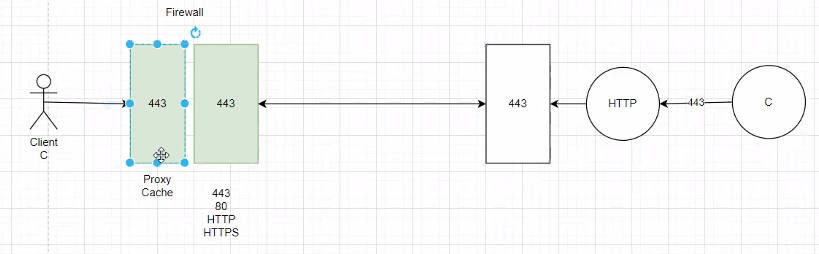
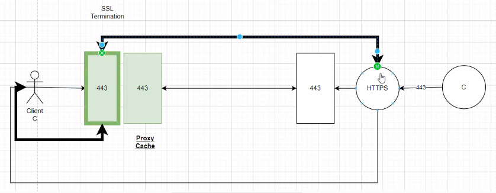
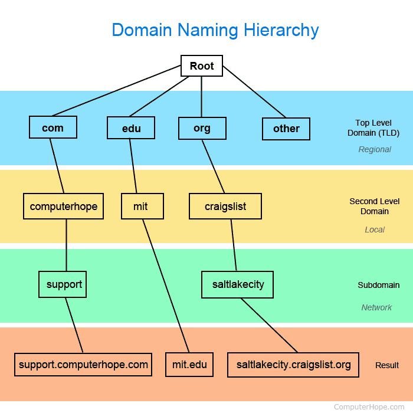

@Jose Daniel Acuna Solano 2018145020

[Repositorio GitHub](https://github.com/JoDaniel1412/evaluaciones-redes)

# Capa Aplicacion

Servicio o aplicacion que haga uso de sockets, vive en el espacio de direccionamiento del usuario

Comparte datos usando:

- ASCII
- UNICODE

Por medio de protocolos:

- HTTP
- SSH

Estos son protocolos basados en caracteres visibles.

**Base64** se utiliza encodificar y decodificar, pero hace uso de memory/cpu/bandwidth en ambos _end-points_, por lo que es costoso. Se puede desminuir el consumo de estos si usaramos caracteres no visibles.

### Optimizacion

Con el fin de reducir el uso del ancho de banda podemos convertir los caracteres a ASCII y reducir el uso de bits desaciendonos de los bits redundante, a cambio de usar memoria y cpu.

## Firewalls

Fitran puertos como:

- 443 (HTTPS)
- 80 (HTTP)
- 8080 (Tomcat)
- 8081

Con el tiempo se estandarizo por popularidad los puertos **443** y **80**.

Figura 1. Diagrama puerto 443 usado por el Firewall para bloquear conecciones no deseadas

Se recomienda usar puertos estandar para que los clientes no tengan problemas con el Firewall al conectarse a la aplicacion

## Proxy

Espectador de la transmicion de datos, se utilizan para filtrar ciertos datos. Normalmente no tiene acceso a la _private-key_ por lo que no puede desencriptar datos.

En algunas empresas se usa como filtro que si desencripta para permitir o bloquear acceso a dominios no deseados.

Figura 2. Diagrama de un Proxy interceptando y filtrando datos

## DNS

Es un sistema NoSQL base de datos distribuido que almacena un par _key-value_, usando un esquema jerarquico basado en dominios. Encargado de resolver un dominio para obtener su direccion IP.

Figura 3. Diagrama de un arbol DNS

Algunas caracteristicas de los DNS:

- **NO** es _case sensitive_
- Tiene un limite de profundidad en el arbol (255 caracteres)
- Subdominios y muchos hosts
- Se explota el negocio de _cybersquatting_

| Tipo  | Descripcion                  | Valor                          |
| ----- | ---------------------------- | ------------------------------ |
| A/AAA | IP v4 o IP v6                | Numero de 32 o 128 bits        |
| MX    | Servidor de email            | Nombres de servidores dominios |
| CNAME | Alias para un solo record    | Nombres de dominios            |
| SPF   | Politicas verificar dominios | Envio seguro de correos        |
| TXT   | Texto                        | Texto descriptivo              |
| PTR   | Busquedas inversas           | Nombre de dominio              |

# Certificados

Se requiere un certificado para validar un dominio para que la comunicacion sea reconocida como segura en Internet, específicamente en conexiones HTTPS.

Un certificado se utiliza para verificar la autenticidad de un sitio web. Cuando un sitio web tiene una conexión HTTPS con un certificado válido, significa que la conexión está encriptada y no puede ser interceptada por terceros.
