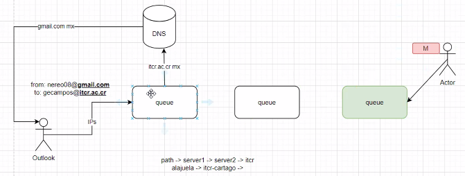
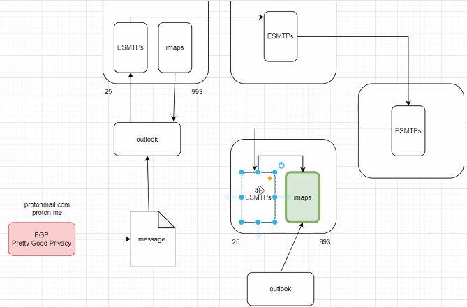
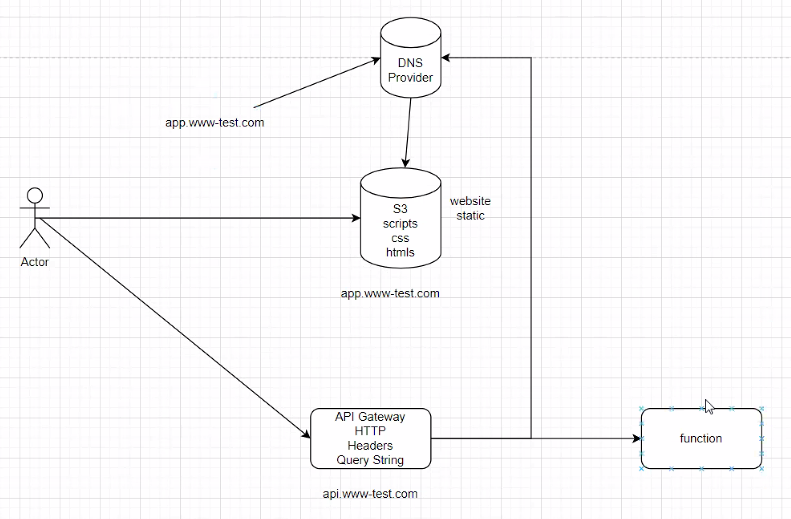

@Jose Daniel Acuna Solano 2018145020

[Repositorio GitHub](https://github.com/JoDaniel1412/evaluaciones-redes/tree/main/apuntes)

# Email

## Simple mail transfer protocol

Poseen dos datos imprecindibles _from_ (emisor ) y _to_ (receptor), ambos son dominios, se solicitan los registros _MX_ al DNS.

Utiliza puerto 25 por lo que no es muy seguro.

Funciona enviando los siguientes mensajes al puerto indicado. Cliente envia:

```
>> HELO <identidad del servidor> I EHLO sidentidad del servidor>
>> FAIL FROM
>> DATA
>> QUIT
>> .
```



Algunas secciones que lleva un correo son:

- Encabezado
- Cuerpo
- Agente de usuario (ex. Outlook)
- Lista de Spammers
- Etiqueta de correos
- Botnets

El etiquetado permite categorizar correos para clasificarlos como: spam, promociones, anuncios, subscripciones, importantes, etc. Hoy se usa IA para extraer informacion de un correo.

### Formato Mensaje

| Encabezado   | Sig                                                                     |
| ------------ | ----------------------------------------------------------------------- |
| To:          | Direccion de correo electronico del los recipientes primarios           |
| Cc:          | Direcciones de correo electronico del los recipientes secundarios       |
| Bcc:         | Direccion de correo electronico para las copias al carbon               |
| From:        | Persona que crea el mensaje                                             |
| Sender:      | Direccion de correo electronico del emisor                              |
| Received:    | Linea que cada agente de transferencia a Io largo de la ruta            |
| Return-path: | Se puede usar para identificar una ruta de vuelta al emisor.            |
| Date:        | Fecha y hora de envio del mensaje                                       |
| Reply-To:    | Direccion de correo electronico a La que se deben enviar las respuestas |
| Message-id:  | Numero unico para hacer referencia a este mensaje después               |
| In-Reply-To: | Identificador del mensaje al que éste responde                          |
| References:  | Otros identificadores de mensaje relevantes                             |
| Keywords:    | Palabras clave seleccionadas por el usuario                             |
| Subject:     | Resumen corto del mensaje para desplegar en una linea                   |

### Autenticacion

El DNS utiliza un SPF para validarle al cliente que si es quien dice ser y evitar ataques de DNS-spoofing.

## ESMTPS

_Enhanced Simple Mail Transfer Protocol Secure_ es una version mejorada el SMTP con mejorar en la capa de seguridad.

## MIME (Multipurpose Internet Mail Extensions)

- Inicialmente solo soportaba texto (RFC 822)
- Describe contenido de aplicaciones (para Web)
- Define reglas de codificacion
- Define la estructura de los mensajes
- IANA

| Encabezado                | Descripcion                  |
| ------------------------- | ---------------------------- |
| MIME-Version              | La version MIME              |
| Content-Description       | Contiene el mensaje ASCII    |
| Content-ID                | Identificador unico          |
| Content-Transfer-Encoding | Como se codifica el mensaje  |
| Content-Type              | Tipo y formato del contenido |

## Arquitectura moderna

Los proovedores como Google y Outlook hacen de intermediarios para acceder al ESMTPs (port 25) y imaps (port 993). Luego de que se recive el correo al ESMTPs adecuado este se lo pasa al _imap_ para que lo almacene en el _Inbox_ correspondiente



### IMAP (Internet Message Access Protocol)

Possee comandos para manipular el _Inbox_

| Comando      | Descripcio                            |
| ------------ | ------------------------------------- |
| CAPABILITY   | Lista las capacidades del servidor    |
| STARTTLS     | Inicia transporte seguro              |
| LOGIN        | Inicia sesion en el servidor          |
| AUTHENTICATE | Inicia sesion con otro método         |
| SELECT       | Selecciona una carpeta                |
| EXAMINE      | Selecciona una carpeta de sOo Jectura |
| CREATE       | Crea una carpeta                      |
| DELETE       | Elimina una carpeta                   |
| RENAME       | Cambia el nombre de una carpeta       |
| SUBSCRIBE    | Agrega carpeta al conjunto activo     |

## WWW (World Wide Web)

Nacio con el proposito de enviar HTML en 1989 (CERN). Algunos conceptos que van de la mano:

- Web Pages
- Links (hipertexto)
- Browser
- HTTP
- Static Page (www-root)
- MIME
- Cookies
- HTML
- CSS
- XML
- JS
- JSON

Surgimiento de Tomcat para generar paginas dinamicas generando HTML _on run time_. Esto evoluciono con JavaScript que movio esta tarea al lado del cliente, donde el _browser_ es el encargado de la parte dinamica.

### Uniform Resource Locator (URL)

Es la manera de desplazarse en **WWW**

- Protocol
- Name
- Path

### API Gateway



### HTTP

Metodo estandar mas usado actualmente para comunicarse con servidor

| Metodo  | Descripcion                            |
| ------- | -------------------------------------- |
| GET     | Leer una pagina web                    |
| POST    | Almacenar una pagina web               |
| PUT     | Adjuntar a una pagina web              |
| DELETE  | Eliminar la pagina web                 |
| TRACE   | Repetit la solicitud entrante          |
| CONNECT | Conectarse a través de un proxy        |
| OPTIONS | Consultar las opciones para una pagina |
