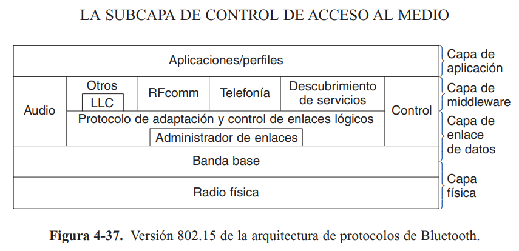
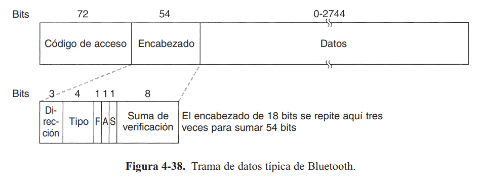

# Bluethooth

Nació por la necesidad de conectar teléfonos móviles y otros dispositivos de manera inalámbrica, corto alcance y poco consumo de energía. Su competencia fueron las redes infra rojas creadas por Hewlett-Packard, pero no alcanzaron mucha popularidad.

## Arquitectura Bluetooth

- Capa de aplicación
- Capa de middleware
- Capa de enlace de datos
- Capa física

El siguiente diagrama muestra responsabilidades de cada capa:

## Aplicaciones de Bluetooth

- Permite que computadores hagan llamadas por redes telefónicas
- Acceso a LAN
- Comunicación FAX con teléfono móvil
- Walkie-talkie digital
- Libres manos
- Transferencia de archivos
- Intercambio de objetos

### Capa de radio

Establece la conexión entre los dispositivos en la banda 2.4GHz (dividida en 79 canales de 1MHz cada uno), encargada de modular y demodular, además de corrección de errores.

### Capa de banda base

Administra las conexiones con múltiples dispositivos, encargada de manejar los canales de cada uno de estos, además transmite y recibe los datos convirtiendo el flujo de bits en tramas.

### Capa L2CAP

Encargada de proveer los servicios a las aplicaciones, contiene protocolos de telefonía (TCS); audio y video (AVCTP); y búsqueda de servicios (SDP). Maneja la multiplexion y desmultiplexion de las fuentes de paquetes.

## Estructura de la trama de Bluetooth

Los primeros 72 bits son el código de acceso, los siguientes 54 el header, y los últimos son variables de 0 a 2744 bits son los datos. En la siguiente imagen se representa una trama.

